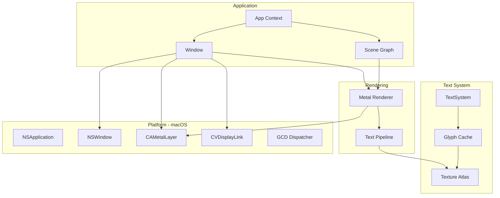

# gooey

**A GPU-accelerated UI framework for Zig, inspired by [GPUI](https://github.com/zed-industries/zed/tree/main/crates/gpui)**

Gooey is a hybrid immediate/retained mode UI framework designed for building fast, GPU-rendered applications on macOS. It uses Metal for rendering and integrates deeply with macOS system APIs.

> ⚠️ **Early Development**: This project is in its initial stages. Currently macOS-only, with plans for cross-platform support.

## Features

- **Metal-Powered Rendering** - Hardware-accelerated rendering with MSAA anti-aliasing
- **CVDisplayLink VSync** - Smooth 60Hz+ frame-paced rendering
- **Text Rendering** - CoreText-based font loading, shaping, and glyph caching
- **Scene Graph** - Collect draw commands (quads, shadows, text) for efficient batched rendering
- **Objective-C Interop** - Clean Zig bindings via [zig-objc](https://github.com/mitchellh/zig-objc)

## Architecture

## Architecture



`

## Project Structure

```
src/
├── main.zig # Example application
├── root.zig # Library root, re-exports public API
├── core/
│ ├── app.zig # Application context
│ ├── geometry.zig # Size, Point, Rect, Color types
│ └── scene.zig # Scene graph (Quad, Shadow, Glyph primitives)
├── font/
│ ├── main.zig # TextSystem - high-level text API
│ ├── face.zig # Font face with metrics
│ ├── shaper.zig # Text shaping (ligatures, kerning)
│ ├── cache.zig # Glyph cache (on-demand rendering)
│ ├── atlas.zig # Texture atlas (skyline bin packing)
│ └── coretext.zig # CoreText FFI bindings
└── platform/
└── mac/
├── platform.zig # MacPlatform (NSApplication wrapper)
├── window.zig # Window (NSWindow + Metal)
├── window_delegate.zig # NSWindowDelegate for events
├── display_link.zig # CVDisplayLink for vsync
├── dispatcher.zig # GCD task dispatcher
└── metal/
├── metal.zig # Module exports
├── api.zig # Metal type definitions
├── renderer.zig # Main renderer
├── quad.zig # Quad shader (rounded rects)
├── shadow.zig # Shadow shader (SDF blur)
└── text.zig # Text pipeline
```

## Quick Start

### Prerequisites

- Zig 0.15.2+
- macOS 12.0+ (Metal required)
- Xcode Command Line Tools

### Build & Run

zig build run # Run the example
zig build test # Run tests

## Roadmap

### Phase 1: Foundation ✅

- [x] Objective-C runtime bindings
- [x] NSWindow + CAMetalLayer setup
- [x] CVDisplayLink vsync
- [x] Basic Metal rendering pipeline
- [x] MSAA anti-aliasing

### Phase 2: Rendering ✅

- [x] Quad rendering (rounded rectangles)
- [x] Shadow rendering (SDF blur)
- [x] Text rendering (CoreText + atlas)
- [x] Retina / scale factor support

### Phase 3: Interactivity 🚧

- [ ] Mouse input handling
- [ ] Keyboard input handling
- [ ] Event dispatch system
- [ ] Hit testing

### Phase 4: Layout System

- [ ] Flexbox layout (port/bind Taffy or Clay.h)
- [ ] Element abstraction
- [ ] View composition

## Inspiration

- **GPUI** - Zed's GPU UI framework
- **Ghostty** - Modern terminal with Zig Metal bindings
- **zig-objc** - Objective-C runtime bindings for Zig
